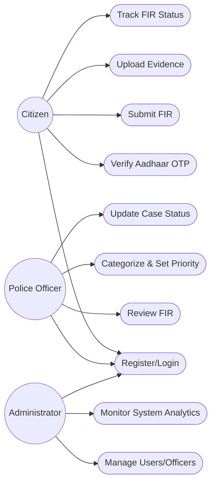
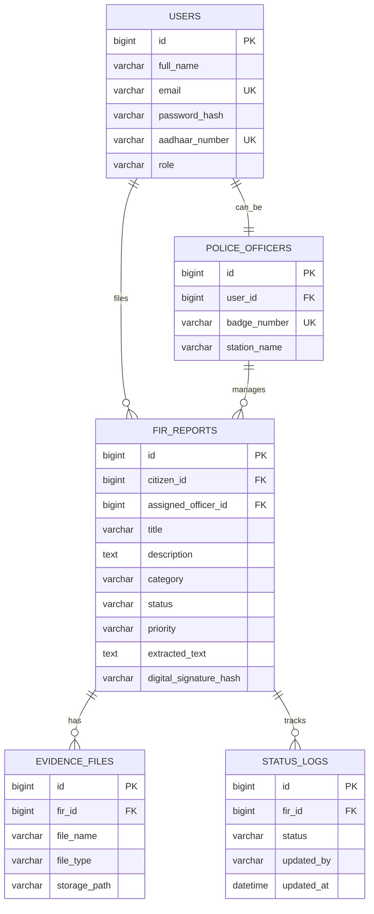
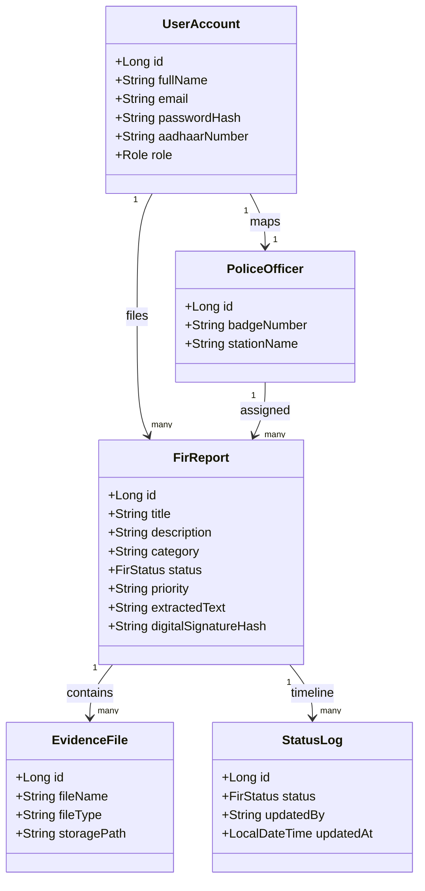
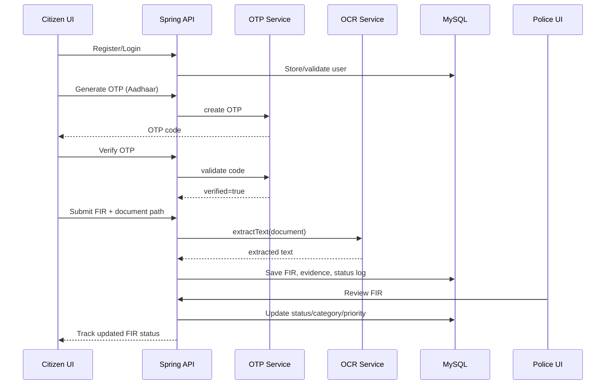
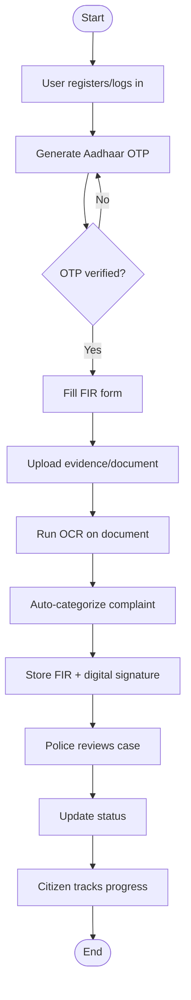
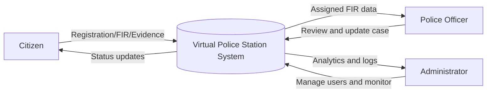
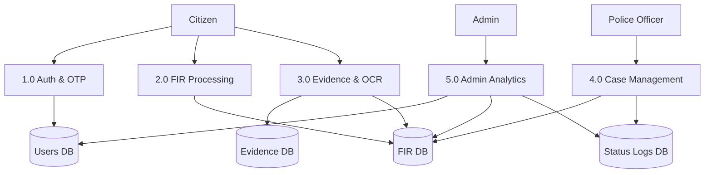
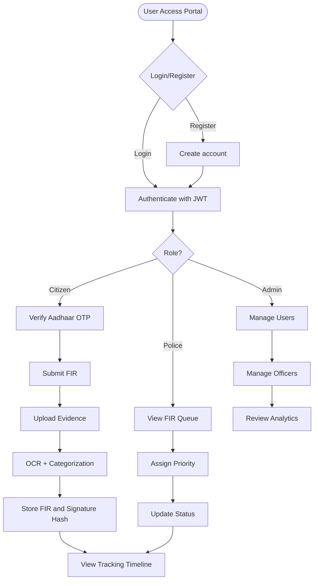

# Virtual Police Station Diagrams

## 1. Use Case Diagram

## 2. ER Diagram

## 3. Class Diagram

## 4. Sequence Diagram

## 5. Activity Diagram

## 6. DFD Level 0

## 7. DFD Level 1

## 8. System Flowchart

